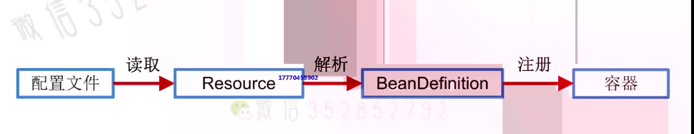

# Bean 与 BeanDefinition
## 001.Bean
1. Bean是Spring中的一等公民
2. Bean的本质就是Java对象，只是这个对象的生命周期由容器来管理
3. 不需要为了创建Bean而在原来的java类上添加任何额外限制
4. Spring对Java对象的控制方式体现在配置上
     - Spring会根据配置(配置文件、注解等方式),生成用来描述Bean的BeanDefinition。
        > 类比:  <font color ='red'>**Java中会使用java.lang.Class来描述对象,而Spring中则是使用BeanDefinition来描述Bean**</font>
         - 常用属性:
             1. 作用范围: scope(@Scope)
             2. 懒加载 lazy-init(@Lazy): 决定Bean实例是否延迟加载
             3. 首选primary(@Primary): 设置为true的Bean会是优先的实现类
                > 当一个接口存在多个实现类，那么设置为true的Bean会被优先选择
             4. factory-bean 和 factory-method(@Configuration 和 @Bean，**即这些属性都可以用在注解上**) 
                ```xml
                  <!-- 1. 使用类的无参构造函数创建 -->
                   <bean id ="user1" class="com.imooc.entity.User" scope="singleton"  lazy-init="true" primary="true"/>
                   
                   <!-- 2.使用静态工厂进行创建 -->
                   <!-- class 的值不是写User对象的全路径，而是写静态工厂的全路径,factory-method的值写要调用的方法 -->
                   <bean id="user2" class="com.imooc.entity.factory.StaticFactory" factory-method="getUser" scope="singleton"/>

                   <!-- 3.使用实例工厂进行创建,需要先创建factoryBean对象，在通过factoryBean对象进行调用 -->
                   <bean id="UserFactory" class="com.imooc.entity.factory.UserFactory"/>
                   <bean id="user3" factory-bean="userFactory" factory-method="getUser" scope="singleton" />

                   <!-- 
                    @Configuration
                    public static FactoryBean {
                        
                        // Factory-Method
                        @Bean
                        public User getUser(){
                            return new User();
                        }

                    }
                   -->
                ```
## 容器初始化主线
1. 配置文件(xml配置文件或者注解)读取
2. 读取配置文件之后,在内存中形成一个个Resource对象
3. 将Resource文件解析为BeanDefinition对象
4. 将BeanDefinition注册到容器中
- 
---------------------------------------------------
## IMPORTANT
+ 需要注意：BeanDefinition 的类型: GenericBeanDefinition
+ RootBeanDefinition, 当bean的定义中有parent属性时，BeanDefinition的类型就是RootBeanDefinition
+ org.springframework.context.support.AbstractXmlApplicationContext#loadBeanDefinitions(org.springframework.beans.factory.support.DefaultListableBeanFactory)下的代码: beanDefinitionReader.setResourceLoader(this); 这句代码将DefaultListableBeanFactory和ResourceLoader绑定，从而打通了资源的解析和BeanDefinition的注册。
-----------------------------------------------------
# 002.BeanDefinition 
## BeanDefinition && AbstractBeanDefinition && GenericBeanDefinition && RootBeanDefinition
### 继承关系图
+ 
+ 在Spring中，Bean Definition之间的继承关系是通过parent属性来表示的。在Spring2.5之后，就是用了GenericBeanDefinition取代其他的BeanDefinition

### RootBeanDefinition
+ RootBeanDefinition,表示的是合并之后的Bean Definition信息