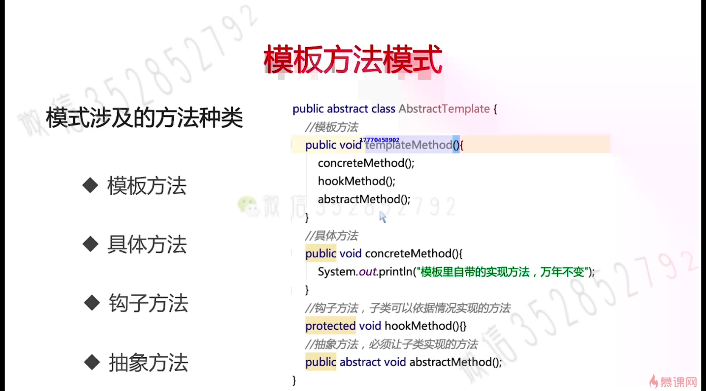

# 模版方法模式
## 简介
定义一个操作中的算法的框架，而将一些步骤延迟到子类中。使得子类可以不改变一个算法的结构即可重定义该算法的某些特定步骤。
## 模式设计的方法种类
+ 
1. 模版方法
  - 模版方法定义了整个业务逻辑的骨架，调用了具体方法，钩子方法和抽象方法，也可以增加的具体逻辑和条件的
2. 具体方法 
  - 模版里自带的实现方法，无需子类进行覆盖
3. 钩子方法
   -   虽然这个方法不是抽象方法，但是没有任何的逻辑在里面。这时候是想要由子类来覆盖这个方法。钩子方法不是指由实现类来直接调用他，而是在特定的时候，特定的条件下由抽象类的调用方来调用，以用于对发生的事件或者条件做出响应。钩子就是故意留下的供子类灵活变更的钥匙。
4. 抽象方法
   - 增强了父类对子类的灵活性.
## 示例
```java
/**
 * 使用KTV来讲解模版方法模式
 */
public abstract class KTVRoom {

	/**
	 * 模版方法
	 */
	public void procedure() {

		// 打开设备
		openDevice();
		// 点歌
		orderSong();
		// 额外消费
		orderExtra();
		// 付款
		pay();

	}

	/**
	 * 模版自带方法，KTV最后是要付款的
	 */
	public void pay() {
		System.out.println("支付本次的消费账单....");
	}

	/**
	 * 钩子方法，额外的开销 "视情况" 而定
	 */
	public void orderExtra() {

	}

	/**
	 * 抽象方法，即子类必须实现的方法，必须得选歌
	 */
	public abstract void orderSong();

	/**
	 * 模版自带方法，使用前必须打开设备
	 */
	public void openDevice() {
		System.out.println("打开视频和音响");
	}
}
```
```java
public class RoomForChinaSonger extends KTVRoom {
	/**
	 * 中国人点歌
	 */
	@Override
	public void orderSong() {
		System.out.println("来一首经典的中文歌曲");
	}

	/**
	 * 中国人觉得东西很便宜，因此消费了一波
	 */
	@Override
	public void orderExtra() {
		System.out.println("东西很便宜，消费一下");
	}
}
```
```java
public class RoomForAmericanSinger extends KTVRoom {
	/**
	 * 外国人点歌
	 */
	@Override
	public void orderSong() {
		System.out.println("来一首中文歌曲的英文版本");
	}

	// 因为老外觉得东西很贵，因此就没有进行额外的消费
}
```

+ [模版方法模式](https://www.jianshu.com/p/82abdbabe2a5)