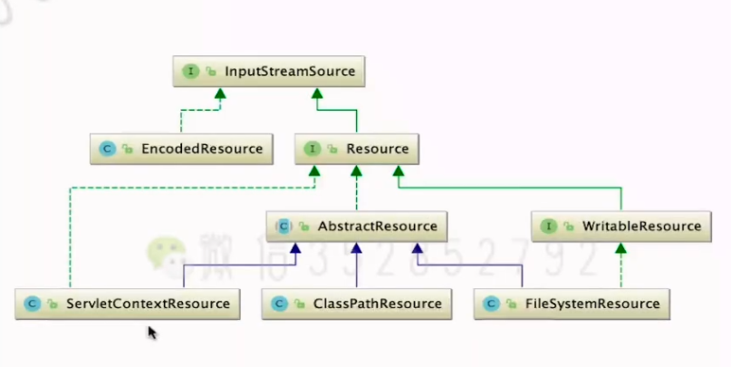
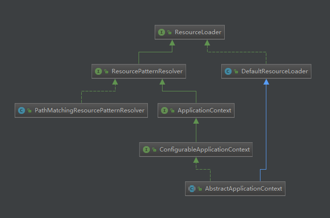

# Resource && ResourceLoader
## Resource
### 背景
+ Spring的Resource接口是一个更强大(多功能)的接口，用于对低级资源的访问。
+ Spring将对物理资源的访问方式抽象为Resource(spring-core\src\main\java\org\springframework\core\io\Resource.java)
+ Resource是Spring对资源访问的抽象，他本身并不提供任何访问资源的实现，具体的资源访问的实现由其实现类来实现，每个实现类提供了对一类资源的访问方式.
+ 
#### 示例
```java
        public static void main(String[] args) throws IOException {

                String path = "./spring-demo/src/main/java/com.imooc/resources/demo/FileSystemResources.txt";
                FileSystemResource resource = new FileSystemResource(path);
                System.out.println(resource.isFile());

                /**
                 * 通过Resource来对文件进行读取操作
                 */
                BufferedReader reader = new BufferedReader(new InputStreamReader(resource.getInputStream()));
                int num = 0;
                char[] arr = new char[1024];
                StringBuffer buffer = new StringBuffer();
                while ((num = reader.read(arr, 0, 1024)) > 0) {
                    buffer.append(new String(arr, 0, num));
                }
                reader.close();
                System.out.println("读取到的内容: " + buffer.toString());

                /**
                 * 通过Resource来对文件进行写入操作
                 */
                BufferedWriter writer = new BufferedWriter(new OutputStreamWriter(resource.getOutputStream()));
                String mess = "Resource 封装的写文件操作";
                writer.write(mess);
                writer.flush();
                writer.close();
            }
```
### 强大的资源方式
+ 自动识别"classpath:" 、 "file:"等资源地址前缀
+ 支持自动解析Ant风格带通配符的资源地址

--------

## ResourceLoader
### 背景
+ 实现不同的Resource加载策略，按需返回特定类型的Resource
+  

###  代码分析路程
1. spring-core\src\main\java\org\springframework\core\io\DefaultResourceLoader.java

## ReaderContext
+  上下文，通过bean定义读取过程传递，封装所有相关配置和状态。