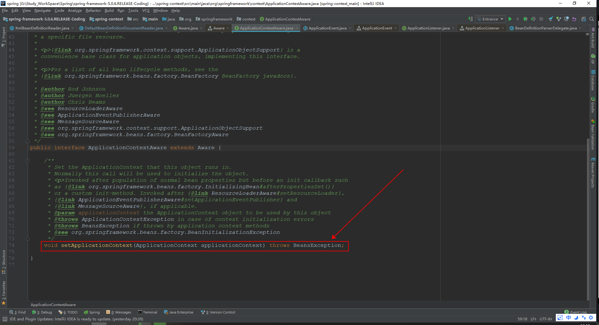
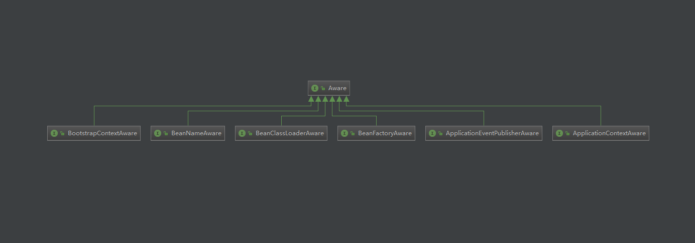

# Aware
+ 释义： adj. 意识到的；知道的；有…方面知识的；懂世故的
## 功能
+ Aware的意思是 “意识到的”，当自定义的类需要使用到容器相关资源的时候，就需要证明自定义的类能够感知到容器以及容器相关资源的存在，那么就通过实现对应的Aware接口来感知。
+ 辅助实现了Aware接口Bean来访问Spring容器中的数据，主要是在容器初始化的过程中调用Aware相关的接口来实现的
    - 如ApplicationContextAware接口就是帮助实现这个接口的类从Bean中获取到的容器实例并对其进行操作(在Bean中对容器进行操作)
       + 
## 接口实现情况
+ 