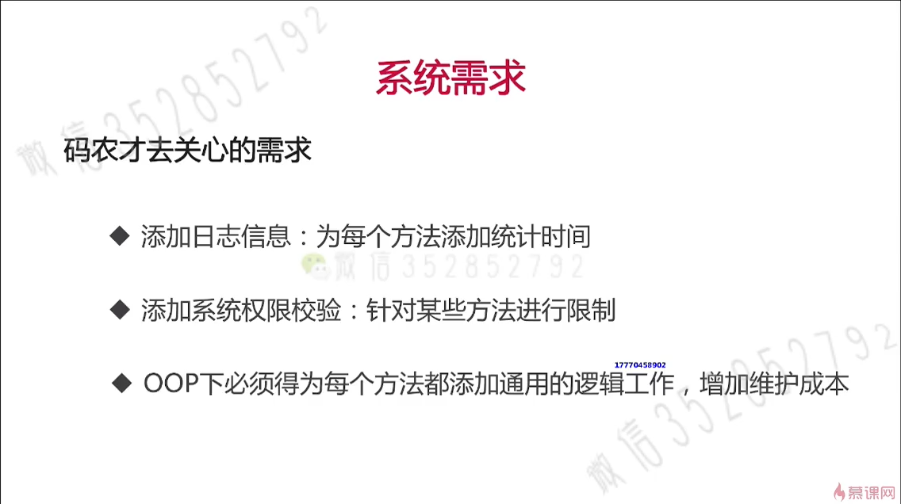
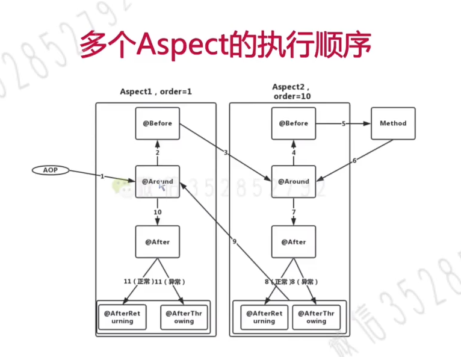

# 引入AOP
## 01. 为什么需要AOP
  + 
## 02.什么是AOP
不同的问题交给不同的部分去解决(关注点分离),每个部分专注解决自己的问题
  1. Aspect Oriented Programming即AOP就是其中一种关注点分离的技术。
  2. 通用化功能的代码实现即切面Aspect
  3. Aspect之于AOP，即相当于Class之于OOP，Bean之于Spring
## 03. AOP概念介绍
### AOP之切面Aspect
+ 将横切关注点逻辑进行模块化封装的实体对象
### AOP之通知Advice
+ 类比于Class中的方法，还定义了织入编辑的时机
#### AOP之Advice类别
1. BeforeAdvice
   - 在JoinPoint前被执行的Advice
2. AfterAdvice
   - 类比于try...catch...finally中的finally
3. AfterReturningAdvice
   - 在JoinPoint执行流程正常返回后被执行
4. AfterThrowingAdvice
   - 在JoinPoint执行过程中抛出异常才会触发
5. AroundAdvice
   - 在JoinPoint前和后都执行 
#### AOP下Advice的执行流程
+ 
### AOP之连接点JoinPoint
+ 允许使用Advice的地方
+ Spring仅支持方法级别的连接点
### AOP之切入点Pointcut
+ 定义一系列规则对JointPoint进行筛选
### AOP之目标对象Target
+ 符合Pointcut条件，要被注入横切逻辑的对象
### AOP核心概念之织入
+ 织入: 将Aspect模块化的横切关注点集成到OOP中
### AOP核心概念之织入器
+ 织入器: 完成织入过程的执行者，如ajc
+ Spring AOP会使用一组类来作为织入器以完成最终的织入操作

