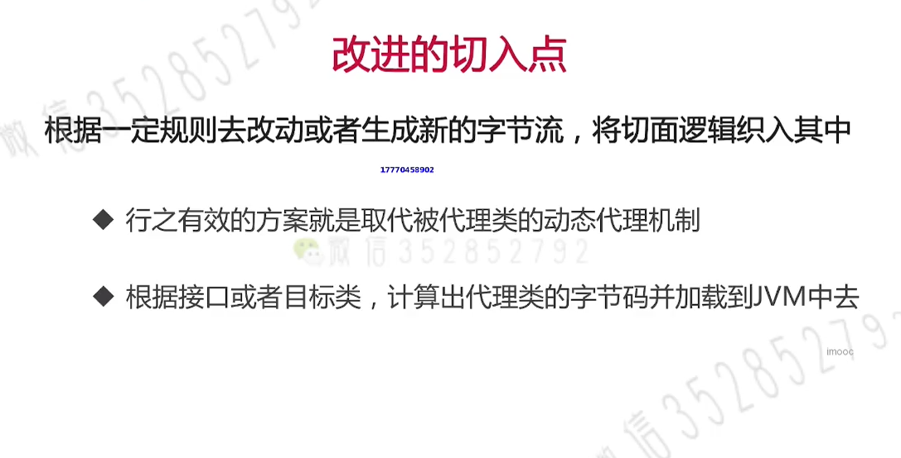

# Spring AOP实现原理
## 00.注意
1. AOP代理，是对方法的调用进行代理，而非对属性进行代理
## 01. 代理模式
+ 
+ 
+ 计算出代理类的字节码并加载到JVM中
   - 
## 02. JDK动态代理
&nbsp;&nbsp;JDK动态代理由JDK提供,详见:java.lang.reflect.Proxy.newProxyInstance
+ 
+ 如代码: com.imooc.proxy.jdkproxy.ProxyMain
## 03. CGLIB动态代理
&nbsp;&nbsp;CGLIB动态代理里面是封装了ASM Java字节码操作框架,会对动态生成子类覆盖父类的非final方法,绑定钩子回调自定义拦截器
+ 
## 04.Aspectj
### 04-1.AspectJ框架
+ 提供了完整的AOp解决方案，是AOP的Java实现版本
    - 定义了切面语法以及切面语法的解析机制
    - 提供了强大的织入工具
+ AspectJ与Spring AOP织入点的比较
  -     
### 04-1.织入时机
+ 
+ Spring AOP仅用到了AspectJ的切面语法，并没有使用ajc编译工具
   - 只是默认不适用，如果想用ajc还是可以引入的
   - 避免增加用户的学习成本
   - 织入机制沿用自己的CGLIB和JDK动态代理

