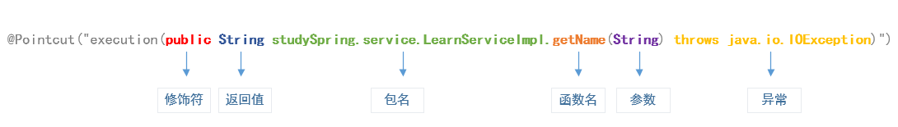

# [Spring AOP 切面表达式(点击进入文档)](https://docs.spring.io/spring-framework/docs/current/reference/html/core.html#aop-ataspectj)
## 背景
&nbsp;&nbsp;Spring AOP仅用到了AspectJ的切面语法，并没有使用ajc编译工具,Spring AOP的代理方式还是JDK动态代理和CGLIB动态代理

&nbsp;&nbsp;从Spring官方文档中看到，Spring AOP并没有支持全部的AspectJ的切面表达式

&nbsp;&nbsp; method execution only in Spring AOP (Spring AOP仅支持方法级别的)
## Spring AOP 切面表达式
&nbsp;&nbsp;AspectJ切面表达式分为三个部分： 指示器 、 通配符 、 操作符
### Spring AOP 切面表达式之 指示器
1. 匹配方法: execution()
2. 匹配注解: @target() , @args() , @within(),@annotation()
3. 匹配包/类型: within()
4. 匹配对象: this() 、 bean()  、 target()
5. 匹配参数: args()
#### Spring 支持的切入点描述符(Supported Pointcut Designators) 来源于Spring文档
&nbsp;&nbsp;Spring AOP supports the following AspectJ pointcut designators (PCD) for use in pointcut expressions:
   - execution: For matching method execution join points. This is the primary pointcut designator to use when working with Spring AOP.
   - within: Limits matching to join points within certain types (the execution of a method declared within a matching type when using Spring AOP).
   - this: Limits matching to join points (the execution of methods when using Spring AOP) where the bean reference (Spring AOP proxy) is an instance of the given type.
   - target: Limits matching to join points (the execution of methods when using Spring AOP) where the target object (application object being proxied) is an instance of the given type.
   - args: Limits matching to join points (the execution of methods when using Spring AOP) where the arguments are instances of the given types.
   - @target: Limits matching to join points (the execution of methods when using Spring AOP) where the class of the executing object has an annotation of the given type.
   - @args: Limits matching to join points (the execution of methods when using Spring AOP) where the runtime type of the actual arguments passed have annotations of the given types.
   - @within: Limits matching to join points within types that have the given annotation (the execution of methods declared in types with the given annotation when using Spring AOP).
   - @annotation: Limits matching to join points where the subject of the join point (the method being run in Spring AOP) has the given annotation.

### Spring AOP 切面表达式之通配符
1.  *: 匹配任意数量的字符
2.  +: 匹配指定类及其子类
3.  ..  :(两点)匹配任意数量的子包或者参数
### Spring AOP 切面表达式之操作符
1. && : 与
2. || : 或
3. ！ : 非
## Spring AOP 切面表达式示例

#### 1. Spring AOP切面表达式之execution
+ execution()匹配方式使用较为广泛,格式如下：
  - 
  - @Pointcut("execution(public * studySpring.service.LearnServiceImpl.get*(..))")
  ```java
     @Pointcut("execution(public * studySpring.service.LearnServiceImpl.get*(..))")
         public void pointCut1(){}
     
         // 前置通知
         @Before("pointCut1()")
         public void before()
         {
             System.out.println("AspectJDemo|before");
         }
  ```
  
#### 2. Spring AOP切面表达式之注解匹配(@target()，@args()，@within()，@annotation())
##### Spring AOP切面表达式之注解匹配之 @annotation()
+ @annotation()可以单独进行使用，其他三种注解，需要指定包或者类
  - 示例代码
  ```java
    @Retention(RetentionPolicy.RUNTIME)
    @Target(ElementType.METHOD)
    public @interface MyAnnotation
    {
    }
    // 使用新注解修饰方法
    @MyAnnotation
    public void learn(String arg)
    {
        System.out.println("enter function learn");
        System.out.println("学习课程：" + arg);
        daoImpl.save(arg);
    }
    // 定义Pointcut，指定注解匹配方法
    @Pointcut("@annotation(studySpring.annotation.MyAnnotation)")
    public void pointCut1(){}

    // 前置通知
    @Before("pointCut1()")
    public void before()
    {
        System.out.println("AspectJDemo|before");
    }
  ```
  
#### Spring AOP切面表达式之注解匹配之 @within(),@target()
+ @target()和@within()匹配标注有指定注解的类中的方法。
+ 从上述的英文注释: @target是方法级别的,@within是类级别的???

   ```java
      @Retention(RetentionPolicy.RUNTIME)
      @Target(ElementType.TYPE)
      public @interface TargetWith
      {
      }
   
      @Component
      @TargetWith
      public class LearnServiceImpl implements ServiceInterface
      {
          
      }
        
     // 定义Pointcut，匹配指定注解的类中的所有方法
     @Pointcut("@target(studySpring.annotation.TargetWith) && within(studySpring.service..*)")
     // @Pointcut("@within(studySpring.annotation.TargetWith) && within(studySpring.service..*)")
     public void pointCut1(){}
        
     // 前置通知
     @Before("pointCut1()")
     public void before()
     {
       System.out.println("AspectJDemo|before");   
     }
  ```
#### Spring AOP切面表达式之注解匹配之 @args()
+ 当使用@args()注解修饰类的时候，对于只用该类作为参数的方法，被拦截。

```java

       @Retention(RetentionPolicy.RUNTIME)
       @Target(ElementType.TYPE)
       public @interface TargetWith
       {
       }
       
       @Component
       @MyArgsAnnotation
       public class Item
       {
           public String name;
           public int grade;
          
       }
       
       // 定义Pointcut，匹配注解修饰的类作为参数的方法
       @Pointcut("@args(studySpring.annotation.MyArgsAnnotation) && within(studySpring.service..*)")
       public void pointCut1(){}
   
       // 前置通知
       @Before("pointCut1()")
       public void before()
       {
           System.out.println("AspectJDemo|before");
       }

```
### 3. Spring AOP切面表达式之包/类型(within())
+ within主要用于匹配指定的类或者包及其子包下的所有方法。

        ```java
        // 定义切入点
            @Pointcut("within(studySpring.service.LearnServiceImpl)")
            public void pointCut1(){}
        
            // 定义切入点
            @Pointcut("within(studySpring.service..*)")
            public void pointCut2(){}
        
            // 前置通知
            @Before("pointCut1()")
            public void before()
            {
                System.out.println("AspectJDemo|before");
            }
        
            // 正常返回后通知
            @AfterReturning("pointCut2()")
            public void afterReturning()
            {
                System.out.println("AspectJDemo|afterReturning");
            }
        ```
### 4. Spring AOP切面表达式之对象匹配(this()，target()，bean())
+ this() 和 target()的用法大体相同，主要作用有2点。第一，用于匹配实现指定接口的aop代理类；第二，匹配指定类的aop代理类。
+ bean() 用于匹配指定名称的bean
#### Spring AOP切面表达式之对象匹配-1. 匹配实现指定接口的aop代理类
+ 匹配实现指定接口的aop代理类（这里使用target和this都可以）
  ```java
            // 匹配实现指定接口的aop代理类，这里使用target和this都可以。
            @Pointcut("target(studySpring.interfaces.ServiceInterface)")
            // @Pointcut("this(studySpring.interfaces.ServiceInterface)")
            public void pointCut1(){}
        
            // 前置通知
            @Before("pointCut1()")
            public void before()
            {
                System.out.println("AspectJDemo|before");
            }
            @Component
            public class LearnServiceImpl implements ServiceInterface
            {
                public void learn(String arg)
                {
                    System.out.println("enter function learn");
                    System.out.println("学习课程：" + arg);
                    daoImpl.save(arg);
                }
            }
            @Component
            public class ShopServiceImpl implements ServiceInterface
            {
                public void getList()
                {
                    System.out.println("enter function ShopServiceImpl.getList()");
                    System.out.println("黑凤梨");
                    System.out.println("巧克力");
                }
            }
  ```
#### Spring AOP切面表达式之对象匹配-2. 匹配指定类的aop代理类
+ 匹配指定类的aop代理类（使用target和this都可以）
    
    ```java
        // 匹配指定类的aop代理类，这里使用target和this都可以。
        @Pointcut("target(studySpring.service.LearnServiceImpl)")
        // @Pointcut("this(studySpring.service.LearnServiceImpl)")
        public void pointCut1(){}
    
        // 前置通知
        @Before("pointCut1()")
        public void before()
        {
            System.out.println("AspectJDemo|before");
        }
    ```
#### Spring AOP切面表达式之对象匹配-3. 匹配指定名称的bean
+ bean() 用于匹配指定名称的bean
   ```java
            // 匹配指定名称的bean：匹配名称中包含Service字符串的bean
            @Pointcut("bean(*Service*)")
            public void pointCut1(){}
        
            // 前置通知
            @Before("pointCut1()")
            public void before()
            {
                System.out.println("AspectJDemo|before");
            }
   ```
### 5. Spring AOP切面表达式之参数匹配(args())
+ 用于匹配指定参数类型的方法，比如args(String)。请注意：
   1. 还可以结合通配符使用，匹配第一个参数为String的方法：args(String,..)
   2. 但是args的匹配方法存在一个使用限制，无法单独使用，必须指定包或者类，否则程序异常

  ```java
    // 匹配第一个参数类型为String，而且在studySpring.service包中的方法。
    @Pointcut("args(String,..) && within(studySpring.service.*)")
    // 匹配参数类型为String，而且名称包含Service字段的bean中的方法。
    // @Pointcut("args(String) && bean(*Service*)")
    public void pointCut1(){}

    // 前置通知
    @Before("pointCut1()")
    public void before()
    {
        System.out.println("AspectJDemo|before");
    }
  ```
   

  