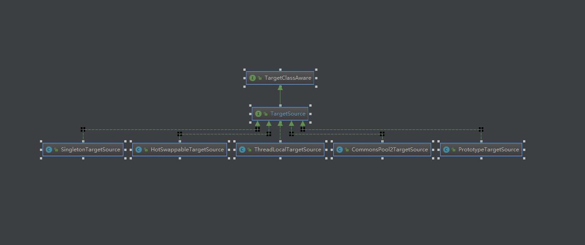

# Spring AOP学习之TargetSource
&nbsp;&nbsp;Spring提供了 TargetSource的概念,用org.springframework.aop.TargetSource接口表示。此接口负责返回实现连接点的“目标对象”。每次AOP代理处理方法调用时，都会要求TargetSource实现一个目标实例。使用Spring AOP的开发人员通常不需要直接使用TargetSource实现，但这提供了支持池、热交换和其他复杂目标的强大方法。例如，池目标源可以通过使用池来管理实例，为每次调用返回不同的目标实例。如果不指定TargetSource，则使用默认实现包装本地对象。每次调用都会返回相同的目标（如您所期望的那样）。

&nbsp;&nbsp;Spring AOP并不是直接使用CGLIB或JDK动态代理(即并不是直接代理被代理的对象，而是要通过代理Class对象实例对应的TargetSource去间接代理被代理对象实例，这是因为通常情况下一个proxy(代理对象)只能代理一个target,每次方法调用的目标都是唯一且固定的，但是如果使用proxy代理TargetSource，那么就可以使得每次方法调用的target实例是不一样的(当然，也是可以相同的，取决于TargetSource的实现)。这种机制使得方法调用更加灵活，可以扩展出很多功能。例如：被代理对象的热替换行为
### TargetSource家族成员
+ 
### 使用
+ org.springframework.aop.framework.CglibAopProxy  == 》 688行（target = targetSource.getTarget();）