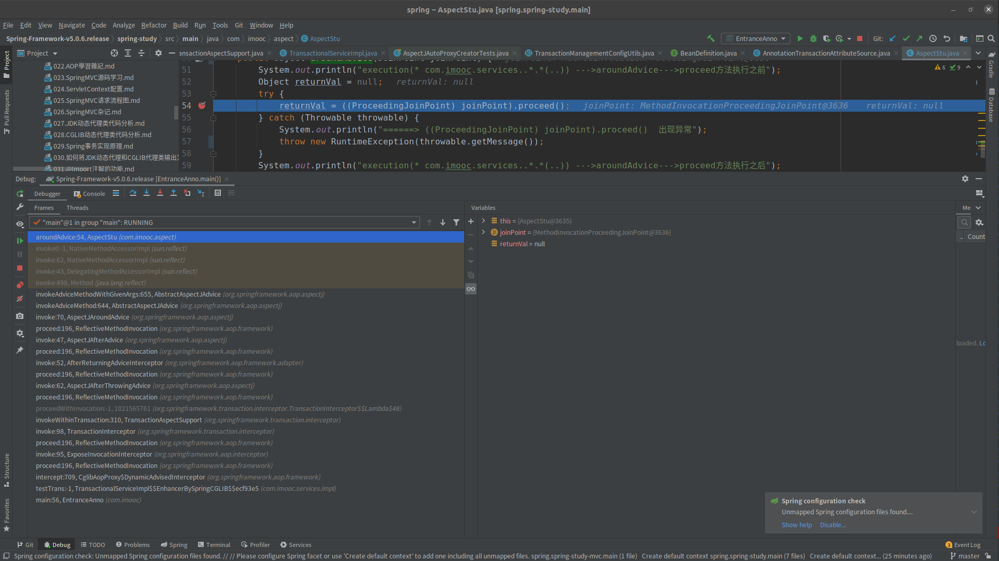

# Spring 中事务与切面的注意事项
&nbsp;&nbsp;从测试代码com.imooc.EntranceAnno 和com.imooc.services.impl.TransactionalServiceImpl.testTransRollBack并配合调试模式可以发现,自然也要结合com.imooc.aspect.AspectStu#aroundAdvice, 可以发现，环绕通知方法是后于事务的MethodInterceptor执行的,因此，当在业务方法(tetsTransRollBack)出现异常的时候，如果在环绕通知中捕获了该异常并且没有将该异常抛出，则会导致事务无法回滚（因为事务管理器没有接收到异常通知）。
   + 
     
      - 查找调用栈
         - com.imooc.aspect.AspectStu.aroundAdvice 在调用栈的什么地方
         - org.springframework.transaction.interceptor.TransactionAspectSupport.invokeWithinTransaction在调用栈的什么地方

&nbsp;&nbsp;那么此时就可以使用一种特殊的方式来解决这个问题了,即将Service层拆解为业务service和数据库service,切面通知不对数据库service提供服务.
