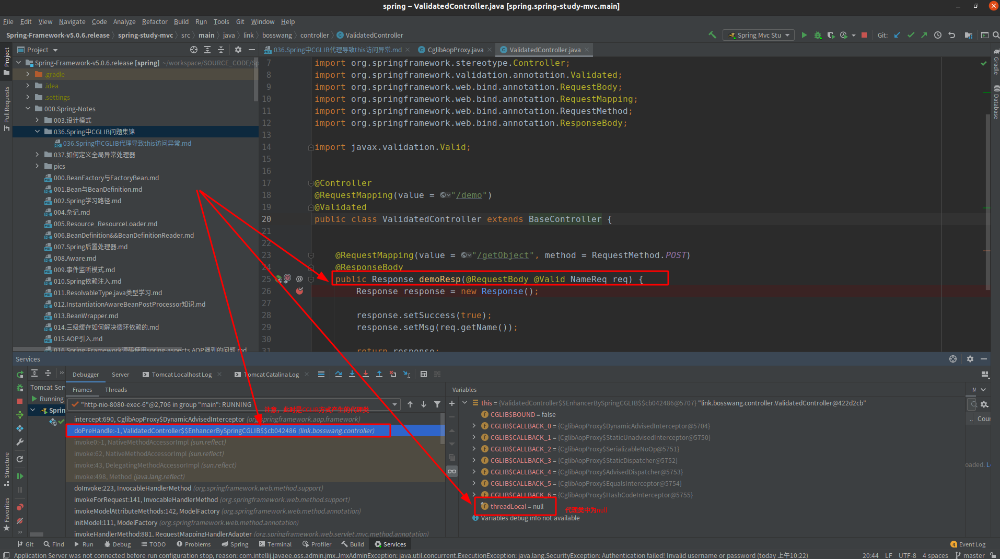
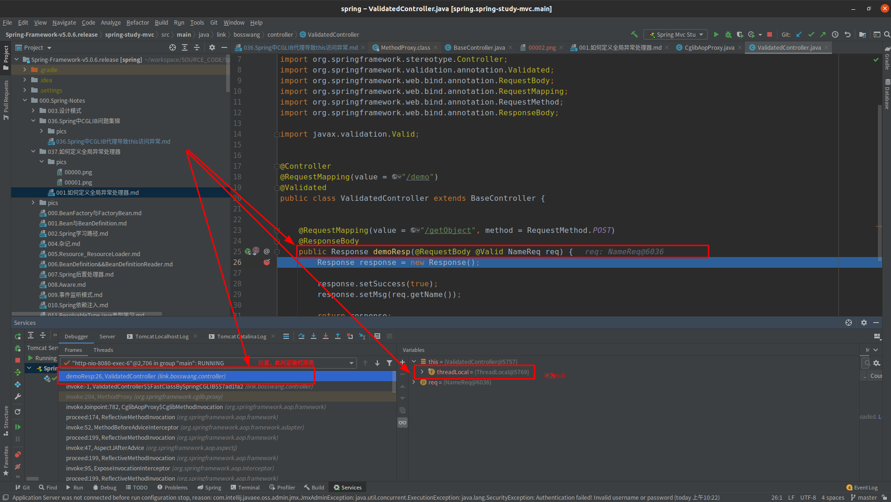

# Spring 中CGLIB代理导致this访问异常
## 背景
&nbsp;&nbsp;在Spring 的CGLIB代理方式中，会出现这么一种情况：当在CGLIB代理类中执行this.被代理类成员属性的时候，会出现NPE。类似于如下情况:
- BaseController
```java
public class BaseController {

    private final ThreadLocal<String> threadLocal = new ThreadLocal<>();

    @ModelAttribute
    public void doPreHandle() {
        System.out.println("Hello World: " + this.threadLocal.toString());
    }

}

```

- ValidatedController
```java
@Controller
@RequestMapping(value = "/demo")
@Validated
public class ValidatedController extends BaseController {


    @RequestMapping(value = "/getObject", method = RequestMethod.POST)
    @ResponseBody
    public Response demoResp(@RequestBody @Valid NameReq req) {
        Response response = new Response();

        response.setSuccess(true);
        response.setMsg(req.getName());

        return response;
    }
}
```
- 使用如下方式生成ValidatedController的代理类
```java
@Aspect
@Component
public class ControllerAdvice {
    /**
     * 切入点定义
     * (* link.bosswang.controller..*.*(..))
     * 第一个“*”代表方法的返回值,与后面的内容使用空格进行分隔
     * link.bosswang.controller代表包名,services后面的两点表示子包
     * 第二个“*”表示类
     * 第三个“*”表示类中的方法
     * (..)表示方法的参数，这里表示的是所有的参数
     * <p>
     * 即： 将包link.bosswang.controller及其子包下的任何类的下的任何参数以及任何返回值的方法都作为切入点
     */
    @Pointcut("execution(* link.bosswang.controller..*.*(..))")
    public void embed() {
    }

    @Before(value = "embed()")
    public void beforeAdvice(JoinPoint joinPoint) {
        System.out.println("I am execution(* link.bosswang.controller..*.*(..)) --->beforeAdvice");
    }

    @After(value = "embed()")
    public void afterAdvice(JoinPoint joinPoint) {
        System.out.println("I am execution(* link.bosswang.controller..*.*(..)) --->afterAdvice");
    }
}
```

&nbsp;&nbsp;通过debug的方式发现：
1. 代理类中threadLocal成员属性为空，但是在代码执行到ValidatedController时，threadLocal是有值的，这是为什么？
    - 首先，Spring CGLIB中的代理对象创建时不会执行super()方法，因此，继承而来的threadLocal不会被初始化，即为null。
    - 其次，那super()没有被执行，那么为什么在正常的情况下还是可以访问到 threadLocal呢？
       + 这是因为Spring 代理，是对TargetSource进行代理，而被代理的实例，是在创建代理类之前就已经创建完毕了的（因此在ValidatedController中threadLocal是有值的）。重点可以去分析一下Spring 代理对象的创建、执行流程

2. 在代理类中threadLocal为null
   - 
   
   
3. 在ValidatedController中threadLocal不为null
   - 

   
------------------------

## 附录
1. Java语言规定，任何类的构造方法，第一行必须调用super()，如果没有，编译器会自动加上
    - 这是因为自动加super()的功能是Java编译器实现的，它发现你没加，就自动给加上，发现你加错了，就报编译错误。但实际上，如果直接构造字节码，一个类的构造方法中，不一定非要调用super()。Spring使用CGLIB构造的Proxy类，是直接生成字节码，并没有源码-编译-字节码这个步骤

