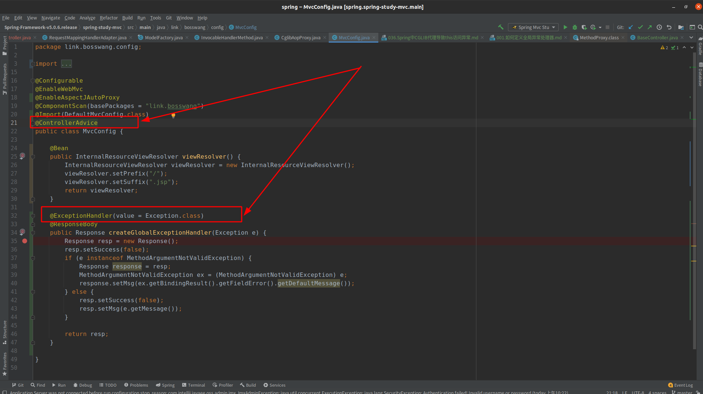
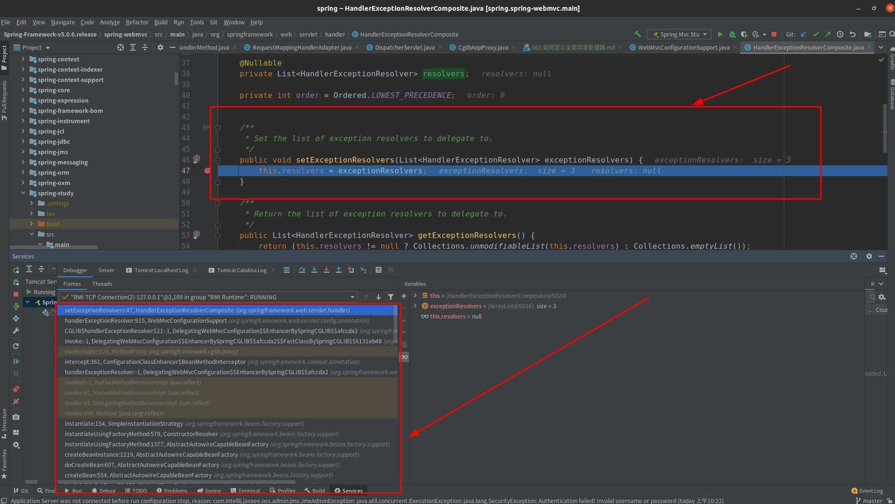

# 如何定义全局异常处理器
## 分析方式
+ Debug + 方法调用栈 进行分析
## 全局异常处理器定义方式如下:

   - 定义全局异常处理器需要用到两个注解，如图，那么为什么需要这两个注解呢？

## 代码分析(详细步骤不列举，仅说明思路)
#### 001.全局异常处理器动作的地方（了解入口）
- org.springframework.web.servlet.DispatcherServlet.doDispatch(调用了processDispatchResult,该方法就会去处理全局异常)
   - 通过debug的方式可以发现：org.springframework.web.servlet.handler.HandlerExceptionResolverComposite.resolvers 存储了所有的全局异常处理器

#### 002. 分析思路
##### “Debug + 方法调用栈” ， 如下图：
- 

&nbsp;&nbsp;通过方法调用栈可以发现，org.springframework.web.servlet.handler.HandlerExceptionResolverComposite.resolvers 
  - 由 org.springframework.web.servlet.handler.HandlerExceptionResolverComposite.setExceptionResolvers 进行初始化
  - 而 org.springframework.web.servlet.handler.HandlerExceptionResolverComposite.setExceptionResolvers 
      - 由 org.springframework.web.servlet.config.annotation.WebMvcConfigurationSupport.handlerExceptionResolver 进行调用，则只需要通过debug的方式来分析
  - 最终，发现自定义全局异常处理器由 org.springframework.web.servlet.mvc.method.annotation.ExceptionHandlerExceptionResolver.initExceptionHandlerAdviceCache 方法进行扫描并注册
      - 通过该方法发现：
           1. Spring会扫描org.springframework.web.bind.annotation.ControllerAdvice注解，再去解析org.springframework.web.bind.annotation.ExceptionHandler注解

   
