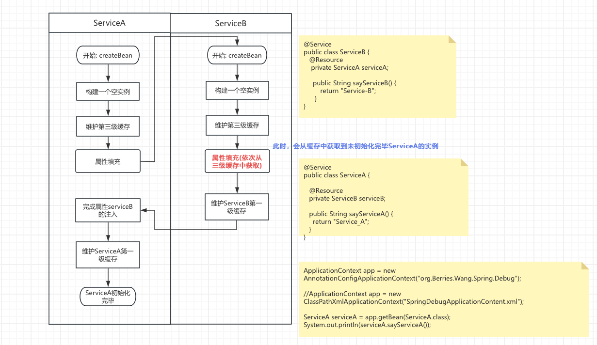

# Spring IOC 与 三级缓存 <sub>解决循环依赖</sub>
## 三级缓存源码
[org.springframework.beans.factory.support.DefaultSingletonBeanRegistry](../../../000.Spring-FrameWork/005.Spring-Framework-6.1.14-GA/spring-beans/src/main/java/org/springframework/beans/factory/support/DefaultSingletonBeanRegistry.java)
```java
	/** 第一级: 缓存初始化完毕的Bean:  Cache of singleton objects: bean name to bean instance. */
	private final Map<String, Object> singletonObjects = new ConcurrentHashMap<>(256);

	/** 第三级: ObjectFactory: 
	 * <pre>
	 *     如代码,添加第三级缓存
	 *     addSingletonFactory(beanName, () -> getEarlyBeanReference(beanName, mbd, bean));
	 * </pre>
	 * Cache of singleton factories: bean name to ObjectFactory. */
	private final Map<String, ObjectFactory<?>> singletonFactories = new HashMap<>(16);

	/** 第三级: 提前暴露的Bean (属性未注入完毕):  Cache of early singleton objects: bean name to bean instance. */
	private final Map<String, Object> earlySingletonObjects = new ConcurrentHashMap<>(16);
```
---

## 三级缓存使用代码
1. 第二&三级缓存应用: [org.springframework.beans.factory.support.DefaultSingletonBeanRegistry#getSingleton(java.lang.String, boolean)](../../../000.Spring-FrameWork/005.Spring-Framework-6.1.14-GA/spring-beans/src/main/java/org/springframework/beans/factory/support/DefaultSingletonBeanRegistry.java)
    > org.springframework.beans.factory.support.AbstractBeanFactory#doGetBean

2. 维护第一级缓存: [org.springframework.beans.factory.support.DefaultSingletonBeanRegistry#getSingleton(java.lang.String, org.springframework.beans.factory.ObjectFactory<?>)](../../../000.Spring-FrameWork/005.Spring-Framework-6.1.14-GA/spring-beans/src/main/java/org/springframework/beans/factory/support/DefaultSingletonBeanRegistry.java)
---

## 如何理解三级缓存解决循环依赖问题?
通过阅读源代码发现,Bean的初始化流程:
> 解析BeanDefinition -> 通过默认构造函数初始化Bean -> 属性注入 -> Bean实例化完毕

在「属性注入」前，维护三级缓存，允许将未初始化完备(属性注入完成)的Bean暴露给IOC容器，使得依赖这个Bean实例的其他单例Bean能够属性注入。如下图:

