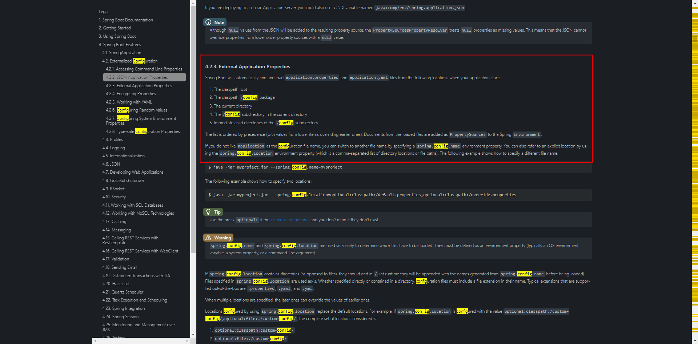
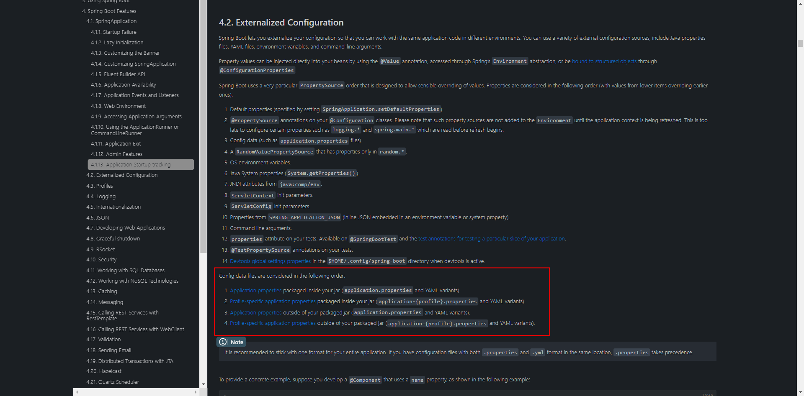

# Spring Boot 配置文件的加载顺序
## 背景
&nbsp;&nbsp;在给基础框架配置打包方案的时候,发现:
1. link-project-common-dal 打成jar包的时候,MyBatis 对应的Mapper.xml文件会被打包到对应的Jar包中,此时程序可以正确加载到对应的Mapper.xml文件
2. link-project-enterprise-open-app 打成jar包的时候,项目的配置文件application.yml以及logback.xml文件都会被打包到对应的Jar包中(计划是将项目配置文件放到target/link-project/conf下,之后方便修改)

&nbsp;&nbsp;此时的疑惑:
1. 既然link-project-common-dal对应的jar包能够正确读取里面的配置文件(Mapper.xml),那么程序启动的时候link-project-enterprise-open-app对应的jar包里面的配置文件是否会与target/link-project/conf下的配置文件相冲突呢?

## 解惑
&nbsp;&nbsp;通过试验以及资料查看,并不会冲突,原因: Spring Boot 配置文件读取解析

### Spring Boot 配置文件读取解析
+ 点击该链接,进入Spring Boot配置文件加载说明的官方文档:[https://docs.spring.io/spring-boot/docs/current-SNAPSHOT/reference/htmlsingle/#boot-features-external-config](https://docs.spring.io/spring-boot/docs/current-SNAPSHOT/reference/htmlsingle/#boot-features-external-config)

####  a. Spring Boot 配置文件的加载位置以及顺序(见文档: 4.2.3. External Application Properties)
&nbsp;&nbsp;文档:[https://docs.spring.io/spring-boot/docs/current-SNAPSHOT/reference/htmlsingle/#boot-features-external-config-files](https://docs.spring.io/spring-boot/docs/current-SNAPSHOT/reference/htmlsingle/#boot-features-external-config-files)

&nbsp;&nbsp;Spring Boot 在启动的时候会从如下的位置自动查找并且加载application.properties 和 application.yaml文件:
1. The classpath root
2. The classpath /config package
3. The current directory
4. The /config subdirectory in the current directory
5. Immediate child directories of the /config subdirectory (/config子目录的直接子目录)

   + 以上列表按照优先级顺序(较低项的值覆盖掉较早项的值,因此**优先级由低到高: 1 -> 5**),所有的文件都会被加载，高优先级的内容会覆盖底优先级的内容，形成互补配置
   - 
   
#### b. Spring Boot 对于Jar包内外的配置文件加载顺序如何   
###### 总结如下:
+ 由jar包外向jar包内进行加载，比如和工程平级目录下面的配置文件优先级高于jar包内部的配置文件
###### 说明
+ 
  
   1. 在jar包内部查找应用配置(application.properties以及YAML变体)
   2. 在jar包内部查找指定环境的应用配置文件(application-{profile}.properties以及YAML变体)
   3. 在jar外部寻找应用配置文件(application.properties以及YAML变体)
   4. 在jar外部寻找指定环境的应用配置文件(application-{profile}.properties以及YAML变体)
  
       -  **优先级由低到高: 1 -> 4**
   
#### c. 目前所采取的一些措施
在link-project-YourProjectName的POM文件中有如下代码: 
```xml
<!--。。。。。。。-->
   <plugin>
    <artifactId>maven-jar-plugin</artifactId>
    <version>3.0.2</version>
    <configuration>
        <!--请注意,这里对应的Maven的生命周期阶段是Package,因此不会影响到Maven的其他生命周期阶段,如 compile,copy-resources-->
        <!--在将项目打成Jar包的时候,排除符合模式的资源文件.注意,这里的根目录: target/classes-->
        <excludes>
            <!--这里仅忽略target/classes下面的配置文件,因项目的配置文件已经打包到target/link-project/conf下,避免混淆-->
            <exclude>*.yml</exclude>
            <exclude>*.xml</exclude>
        </excludes>
    </configuration>
</plugin>
<!--。。。。。。。。。-->
```
+ 请注意,这里对应的Maven的生命周期阶段是Package,因此不会影响到Maven的其他生命周期阶段,如 compile,copy-resources
   - 生命周期阶段所绑定的插件目标,请查看官方文档

+ 如上代码,是为了在将模块打成jar包的时候,过滤一些应用的配置文件(application.yml,logback.xml),使得这些配置文件不打到jar包中,统一使用conf下的配置文件，避免混淆